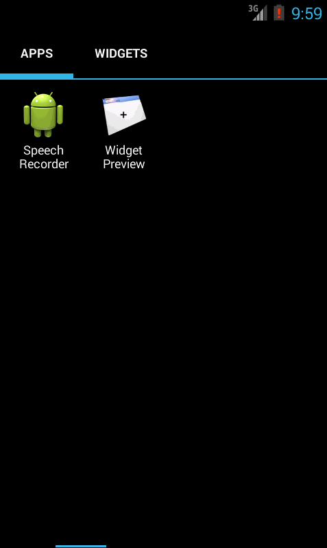
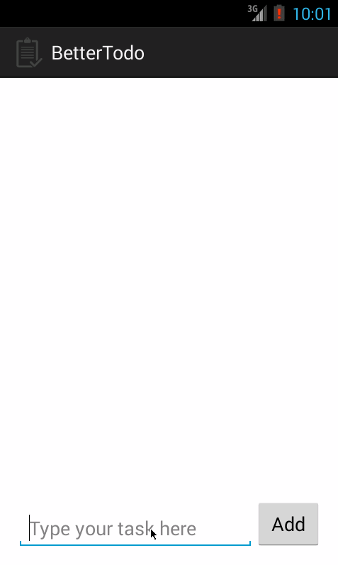
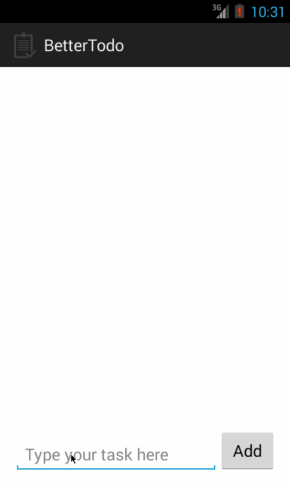
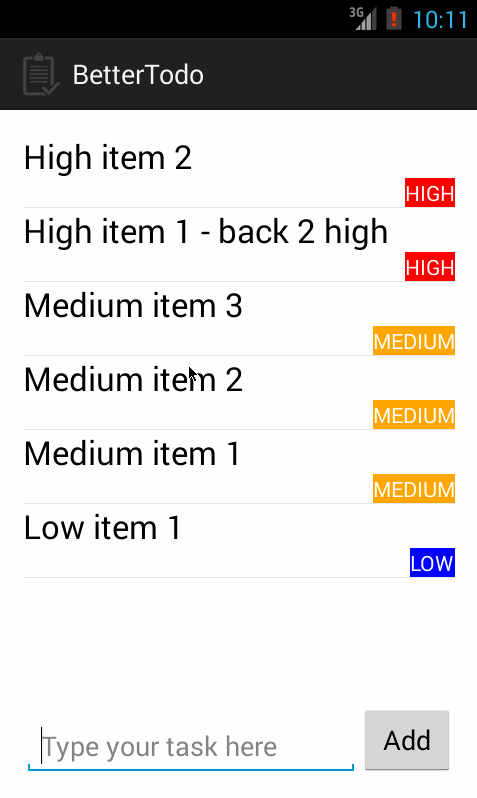
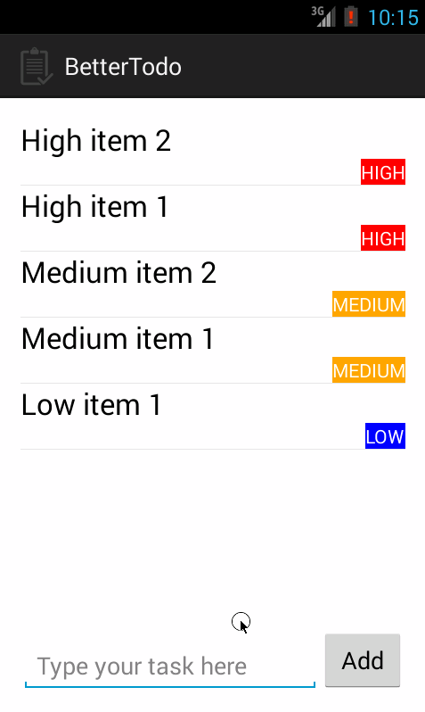
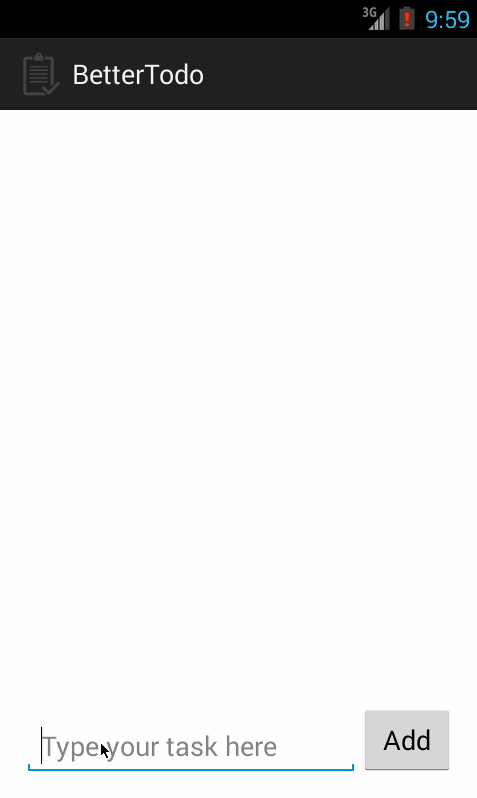
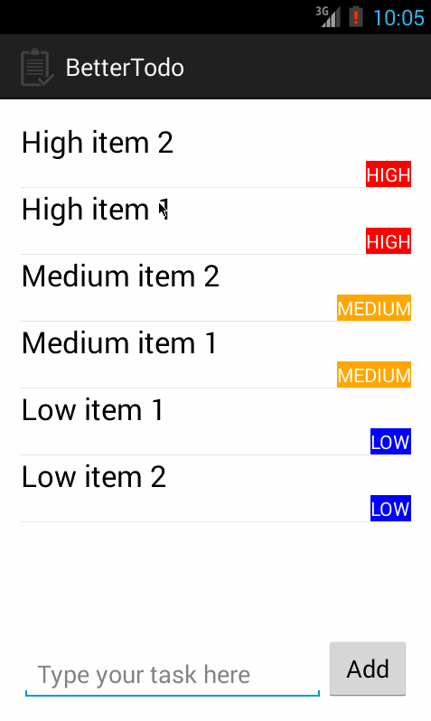
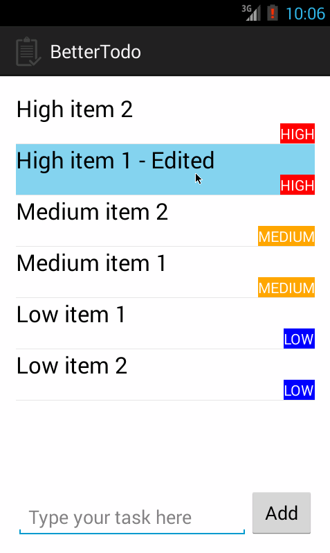
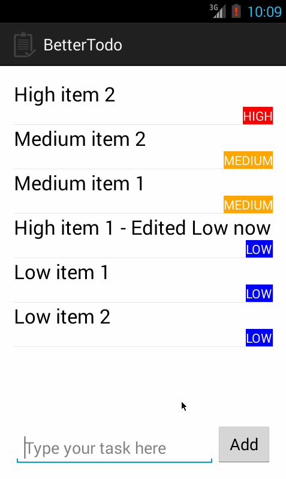

# My Simple Todo App (Better Todo)

This is a simple Todo Android App that I developed for CodePath BootCamp Selection.

Time spent : Honestly din't keep track of time.

Completed User Stories :
 * [x] Required : Users can add a task to the todo list.
 * [x] Required : Long pressing on a item in the list will remove the task or item from the todo list.
 * [x] Required : Short press or single tap on a list item, takes the user to the edit task activity.
 
 * [x] Optional : **Item Prioirty :** Each task or todo item has a priority associated with it.
 * [x] Optional : **Item Prioirty :** The todo items are sorted based on their priority, i.e High priority items first then Medium Prioirty and then Low Prioirty. 
 * [x] Optional : **Item Prioirty :** The items with same priority or not ordered in any particular order.
 * [x] Optional : **UI Improvement :**  Each List item has custom view for supporting the display of item prioirty(right allinged).
 * [x] Optional : **UI Improvement :** Priorty tags for each items are color coded. RED == HIGH, ORANGE == MEDIUM, BLUE == LOW.
 * [x] Optional : **UI Improvement :** When Items are added a *Toast* message is dispalyed.
 * [x] Optional : **UI Improvement :** Bought a fancy app launcher icon from https://www.iconfinder.com/ .
 * [x] Optional : **DialogFragment :** When a task or item is first added to the todolist, a dialog fragment is displayed to the use to select the priorty of the task. The prioritys are displayed as a radio buttons inside a radio group.
 * [x] Optional : **Feature :** User cannot add an empty task.
 * [x] Optional : **Feature :** User cannot add add the same task twice.
 * [x] Optional : **Feature :** User can edit or change the todo item's name (task name) and also its priority in the edit activity screen.
 * [x] Optional : **Feature :** User cannot edit the name of a task to empty string.
 * [x] Optional : **SQLite :** Storing all the tasks or todo items in sqlite database.
 * [x] Optional : **SQLite :** The table to store the todo items has 2 columns |{taskName, String}|{taskPriority, String}|
 
Complete dif demo of the app,

Below are the gif images of the spefic user stories of the app,

**Launching the app :**

**Adding tasks to the todo list :**

**Adding same task :**

**Item remove :**

**Removing all items :**

**Adding empty task :**

**Changing task item name :**

**Changing task item priority :**

**Changing task item priority and text :**

